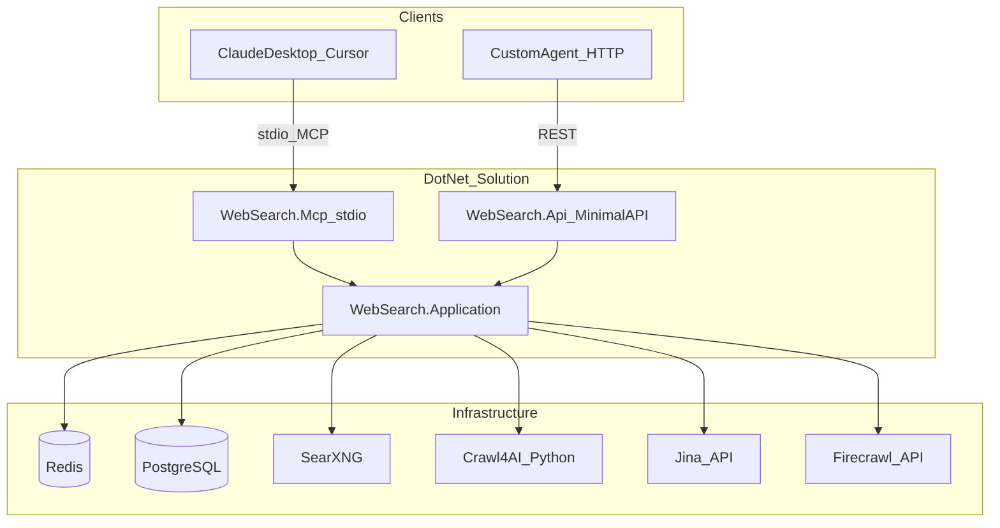

# Architecture

## Overview

WebSearch exposes web search and page scraping to AI agents through two protocol layers over a single business-logic core.



## Components

| Component | Role |
|-----------|------|
| `WebSearch.Application` | Search/scrape services, Redis cache, HTTP clients, EF Core logging |
| `WebSearch.Api` | Minimal API: `GET /search`, `POST /scrape`, `GET /health` |
| `WebSearch.Mcp` | stdio MCP server exposing `web_search` and `web_scrape` tools |
| SearXNG | Self-hosted meta-search engine (JSON API) |
| Crawl4AI | Python sidecar for headless page rendering → markdown |
| Redis | Response cache |
| PostgreSQL | Request audit log |

## Search flow

1. Client sends query via `GET /search` or `POST /search`
2. Normalize query (trim, collapse spaces, full-width → half-width, insert space between Latin and CJK)
3. Check Redis cache (`search:{sha256(normalizedQuery)}:{maxResults}`)
4. On miss: call SearXNG `GET /search?q=...&format=json`
5. Cache result (TTL default 2h), return structured JSON with `cacheHit`

Equivalent queries share cache, e.g. `asyncio最佳实践` and `asyncio 最佳实践`.

## Scrape flow (with fallback)

1. Client sends URL via `POST /scrape`
2. Canonicalize URL (lowercase host, strip trailing slash, sort query params, drop fragment)
3. Check Redis cache (`scrape:{sha256(canonicalUrl)}`)
4. On miss, try providers in order:

```
Crawl4AI (internal) → Firecrawl (API) → Jina Reader (API)
```

4. Cache successful result, return `{ content, source }`

## Cache keys

Keys use SHA-256 hashes of **normalized** query / **canonical** URL:

```
search:{sha256(normalizedQuery)}:{maxResults}
scrape:{sha256(canonicalUrl)}
```

TTL defaults: search **2h** (`7200s`), scrape **24h** (`86400s`). Configure under `Cache` in `appsettings.json`.

Redis is **global shared** across all agents — user B benefits from user A's cache for the same normalized query or canonical URL.

## Design principles

- Business logic lives only in `WebSearch.Application`
- API and MCP are thin protocol adapters
- Crawl4AI is isolated in Python (no C# port exists)
- Network I/O dominates latency; framework choice is not the bottleneck
